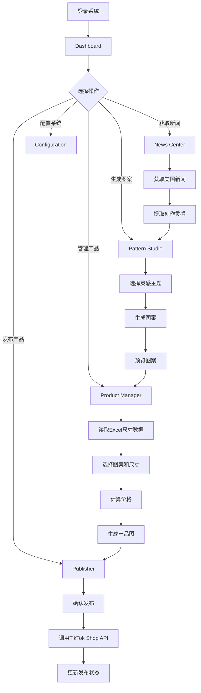

## 1. Product Overview
智能商品上架系统是一个基于AI的自动化产品创作与发布平台，通过获取美国最新新闻热点，自动提取图案创作灵感，生成地毯产品图并计算价格，最终发布到TikTok Shop电商平台。
- **核心价值**：自动化、智能化的产品上架流程，降低人工成本，提高上架效率
- **目标用户**：地毯电商卖家、产品设计师、运营人员

## 2. Core Features

### 2.1 User Roles
| Role | Registration Method | Core Permissions |
|------|---------------------|------------------|
| Admin | Email + Password | Full access to all features |

### 2.2 Feature Module
1. **Dashboard**：系统概览、运行状态、任务进度
2. **Configuration**：API配置、价格参数设置、新闻源管理
3. **News Center**：新闻获取、热点分析、图案灵感提取
4. **Pattern Studio**：图案预览、尺寸选择、AI生成管理
5. **Product Manager**：产品列表、价格计算、产品图生成
6. **Publisher**：TikTok Shop发布、发布历史、状态跟踪

### 2.3 Page Details
| Page Name | Module Name | Feature description |
|-----------|-------------|---------------------|
| Dashboard | System Status | 显示系统运行状态、最近任务、统计数据 |
| Dashboard | Quick Actions | 快捷操作按钮：一键生成、发布产品 |
| Configuration | API Settings | 配置AI图像生成API、TikTok Shop API密钥 |
| Configuration | Price Settings | 设置运费、佣金率、包装费、税率、利润率 |
| Configuration | News Sources | 管理新闻源列表和优先级 |
| News Center | News List | 展示获取的最新美国新闻，支持筛选和搜索 |
| News Center | Inspiration Extractor | 分析新闻提取视觉关键词、配色方案、创作主题 |
| Pattern Studio | Pattern Gallery | 展示生成的图案列表，支持预览和下载 |
| Pattern Studio | Generate Pattern | 根据提取的灵感生成新图案 |
| Product Manager | Product List | 展示已生成的产品列表，包含SKU、尺寸、价格 |
| Product Manager | Generate Product | 选择图案和尺寸生成产品图和价格 |
| Publisher | Publish Queue | 待发布产品队列，支持批量发布 |
| Publisher | Publish History | 发布历史记录，显示发布状态和结果 |

## 3. Core Process

## 4. User Interface Design

### 4.1 Design Style
- **主色调**：深蓝(#1e3a5f) + 橙色(#f59e0b)，科技感与活力并存
- **按钮风格**：圆角矩形，悬停时有渐变效果
- **字体**：Inter（现代简洁）
- **布局风格**：侧边栏导航 + 卡片式内容区
- **图标风格**：Lucide React图标库

### 4.2 Page Design Overview
| Page Name | Module Name | UI Elements |
|-----------|-------------|-------------|
| Dashboard | Hero Section | 统计卡片、进度条、快捷按钮 |
| Dashboard | Task List | 任务卡片列表，显示状态标签 |
| Configuration | Settings Panel | 表单输入、开关控件、保存按钮 |
| News Center | News Card | 标题、摘要、日期、热点标签 |
| Pattern Studio | Pattern Grid | 图片卡片网格布局、hover放大效果 |
| Product Manager | Product Table | 表格展示、操作按钮列 |
| Publisher | Publish Queue | 列表卡片、批量操作、状态图标 |

### 4.3 Responsiveness
- **Desktop-first**：主设计针对1280px+屏幕
- **Tablet适配**：768px-1279px，侧边栏收缩为图标
- **Mobile适配**：<768px，使用底部导航栏

### 4.4 Animation Effects
- 页面加载时渐入动画
- 按钮hover时缩放和阴影变化
- 卡片点击时翻转效果
- 任务完成时的庆祝动画