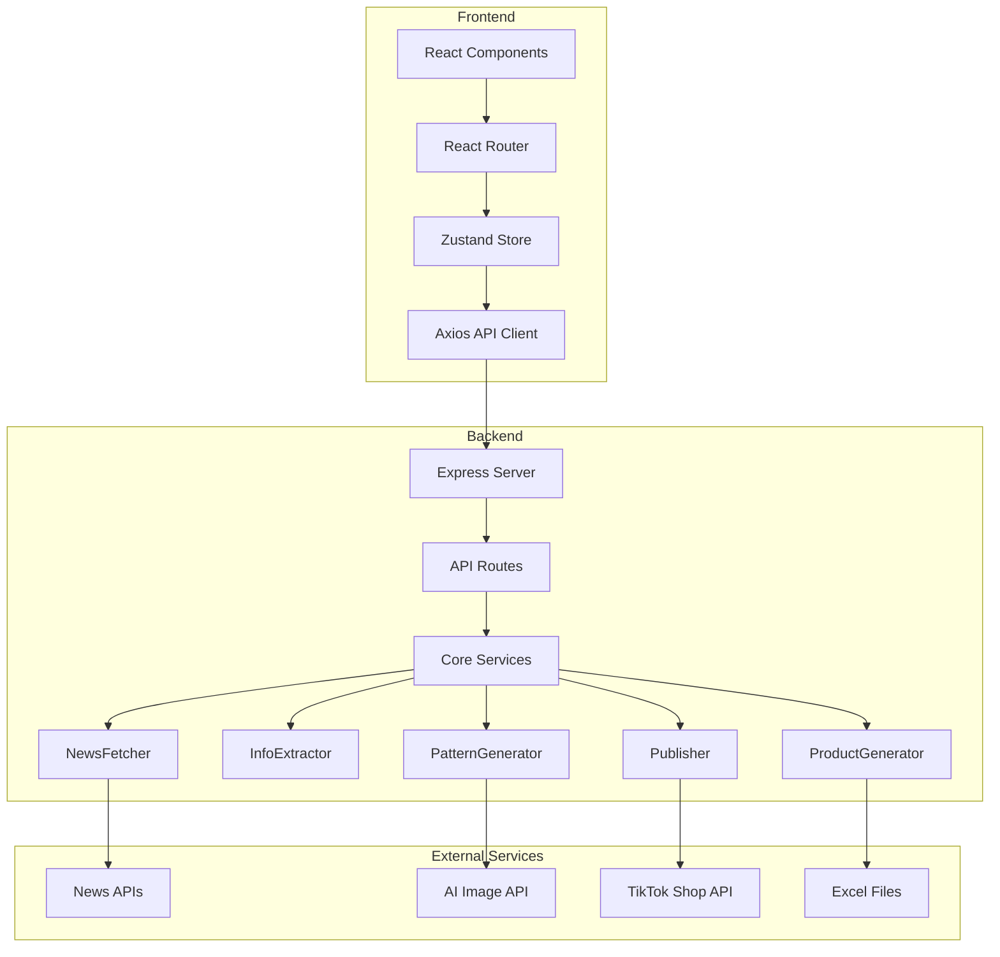
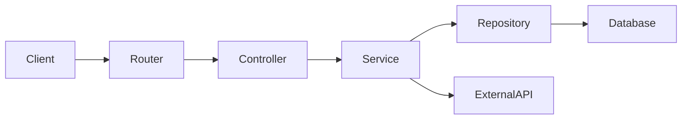

## 1. Architecture Design



## 2. Technology Description
- **Frontend**: React@18 + TypeScript + TailwindCSS@3 + Vite
- **State Management**: Zustand
- **Routing**: React Router DOM
- **Icons**: Lucide React
- **Backend**: Express@4 + TypeScript
- **HTTP Client**: Axios
- **Excel Processing**: OpenPyXL
- **Image Processing**: Pillow
- **Database**: SQLite (轻量级本地存储)

## 3. Route Definitions
| Route | Purpose | Component |
|-------|---------|-----------|
| / | Dashboard | Dashboard.tsx |
| /config | Configuration | Configuration.tsx |
| /news | News Center | NewsCenter.tsx |
| /patterns | Pattern Studio | PatternStudio.tsx |
| /products | Product Manager | ProductManager.tsx |
| /publish | Publisher | Publisher.tsx |

## 4. API Definitions

### 4.1 Configuration API
```typescript
interface Config {
  price_settings: {
    shipping_fee: number;
    platform_commission_rate: number;
    packaging_fee: number;
    tax_rate: number;
    profit_rate: number;
  };
  ai_image: {
    api_provider: string;
    api_key: string;
    image_size: string;
  };
  tiktok_shop: {
    api_key: string;
    api_secret: string;
    region: string;
  };
  scheduler: {
    enabled: boolean;
    schedule: string;
  };
}

// GET /api/config
// Response: Config

// PUT /api/config
// Request: Partial<Config>
// Response: Config
```

### 4.2 News API
```typescript
interface NewsItem {
  id: string;
  title: string;
  summary: string;
  source: string;
  category: string;
  keywords: string[];
  publish_date: string;
  extracted_info?: ExtractedInfo;
}

interface ExtractedInfo {
  themes: string[];
  colors: string[];
  elements: string[];
  styles: string[];
}

// GET /api/news
// Query: limit, offset, category
// Response: { items: NewsItem[], total: number }

// POST /api/news/fetch
// Response: { success: boolean, count: number }

// POST /api/news/extract/:id
// Response: ExtractedInfo
```

### 4.3 Pattern API
```typescript
interface Pattern {
  id: string;
  name: string;
  theme: string;
  colors: string[];
  sizes: string[];
  image_urls: Record<string, string>;
  created_at: string;
}

// GET /api/patterns
// Response: Pattern[]

// POST /api/patterns/generate
// Request: { theme: string, colors: string[], elements: string[], sizes: string[] }
// Response: Pattern

// DELETE /api/patterns/:id
// Response: { success: boolean }
```

### 4.4 Product API
```typescript
interface Product {
  id: string;
  sku: string;
  name: string;
  pattern_id: string;
  pattern_name: string;
  size_cm: string;
  production_size_cm: string;
  material: string;
  cost_price: number;
  selling_price: number;
  price_breakdown: {
    cost: number;
    shipping: number;
    commission: number;
    packaging: number;
    tax: number;
    profit: number;
  };
  image_url: string;
  status: 'draft' | 'pending' | 'published';
  created_at: string;
}

// GET /api/products
// Response: Product[]

// POST /api/products/generate
// Request: { pattern_id: string, size_ids: string[] }
// Response: Product[]

// DELETE /api/products/:id
// Response: { success: boolean }
```

### 4.5 Publisher API
```typescript
interface PublishTask {
  id: string;
  product_id: string;
  product_name: string;
  status: 'pending' | 'publishing' | 'success' | 'failed';
  error_message?: string;
  published_at?: string;
  created_at: string;
}

// GET /api/publish/tasks
// Response: PublishTask[]

// POST /api/publish
// Request: { product_ids: string[] }
// Response: { task_ids: string[] }

// GET /api/publish/tasks/:id
// Response: PublishTask
```

## 5. Server Architecture Diagram



## 6. Data Model

### 6.1 Data Model Definition

```mermaid
erDiagram
    CONFIG ||--o{ NEWS : "has"
    NEWS ||--o{ PATTERN : "inspires"
    PATTERN ||--o{ PRODUCT : "generates"
    PRODUCT ||--o{ PUBLISH_TASK : "has"
    
    CONFIG {
        id INTEGER PK
        price_settings JSON
        ai_image JSON
        tiktok_shop JSON
        scheduler JSON
        created_at DATETIME
        updated_at DATETIME
    }
    
    NEWS {
        id VARCHAR PK
        title TEXT
        summary TEXT
        source VARCHAR
        category VARCHAR
        keywords TEXT[]
        publish_date DATETIME
        extracted_info JSON
        created_at DATETIME
    }
    
    PATTERN {
        id VARCHAR PK
        name VARCHAR
        theme VARCHAR
        colors TEXT[]
        sizes TEXT[]
        image_urls JSON
        news_id VARCHAR FK
        created_at DATETIME
    }
    
    PRODUCT {
        id VARCHAR PK
        sku VARCHAR
        name VARCHAR
        pattern_id VARCHAR FK
        size_cm VARCHAR
        production_size_cm VARCHAR
        material VARCHAR
        cost_price DECIMAL
        selling_price DECIMAL
        price_breakdown JSON
        image_url VARCHAR
        status VARCHAR
        created_at DATETIME
    }
    
    PUBLISH_TASK {
        id VARCHAR PK
        product_id VARCHAR FK
        status VARCHAR
        error_message TEXT
        published_at DATETIME
        created_at DATETIME
    }
```


### 6.2 Data Definition Language
```sql
CREATE TABLE config (
    id INTEGER PRIMARY KEY AUTOINCREMENT,
    price_settings TEXT NOT NULL,
    ai_image TEXT NOT NULL,
    tiktok_shop TEXT NOT NULL,
    scheduler TEXT NOT NULL,
    created_at TIMESTAMP DEFAULT CURRENT_TIMESTAMP,
    updated_at TIMESTAMP DEFAULT CURRENT_TIMESTAMP
);

CREATE TABLE news (
    id VARCHAR(36) PRIMARY KEY,
    title TEXT NOT NULL,
    summary TEXT,
    source VARCHAR(100),
    category VARCHAR(50),
    keywords TEXT,
    publish_date TIMESTAMP,
    extracted_info TEXT,
    created_at TIMESTAMP DEFAULT CURRENT_TIMESTAMP
);

CREATE TABLE pattern (
    id VARCHAR(36) PRIMARY KEY,
    name VARCHAR(100) NOT NULL,
    theme VARCHAR(50),
    colors TEXT,
    sizes TEXT,
    image_urls TEXT NOT NULL,
    news_id VARCHAR(36),
    created_at TIMESTAMP DEFAULT CURRENT_TIMESTAMP,
    FOREIGN KEY (news_id) REFERENCES news(id)
);

CREATE TABLE product (
    id VARCHAR(36) PRIMARY KEY,
    sku VARCHAR(50) NOT NULL,
    name VARCHAR(200) NOT NULL,
    pattern_id VARCHAR(36),
    size_cm VARCHAR(20),
    production_size_cm VARCHAR(20),
    material VARCHAR(100),
    cost_price DECIMAL(10,2),
    selling_price DECIMAL(10,2),
    price_breakdown TEXT,
    image_url VARCHAR(500),
    status VARCHAR(20) DEFAULT 'draft',
    created_at TIMESTAMP DEFAULT CURRENT_TIMESTAMP,
    FOREIGN KEY (pattern_id) REFERENCES pattern(id)
);

CREATE TABLE publish_task (
    id VARCHAR(36) PRIMARY KEY,
    product_id VARCHAR(36),
    status VARCHAR(20) DEFAULT 'pending',
    error_message TEXT,
    published_at TIMESTAMP,
    created_at TIMESTAMP DEFAULT CURRENT_TIMESTAMP,
    FOREIGN KEY (product_id) REFERENCES product(id)
);
```